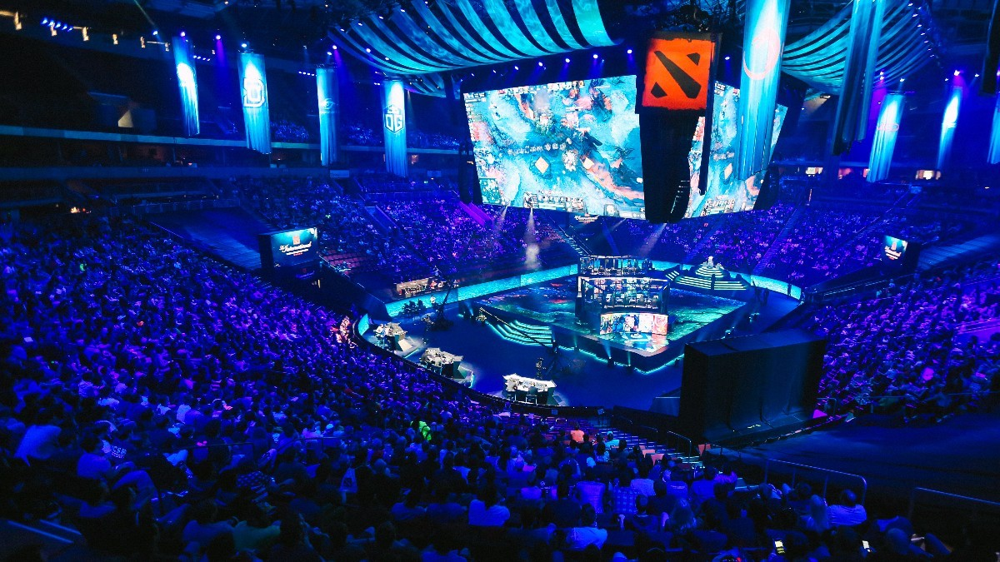
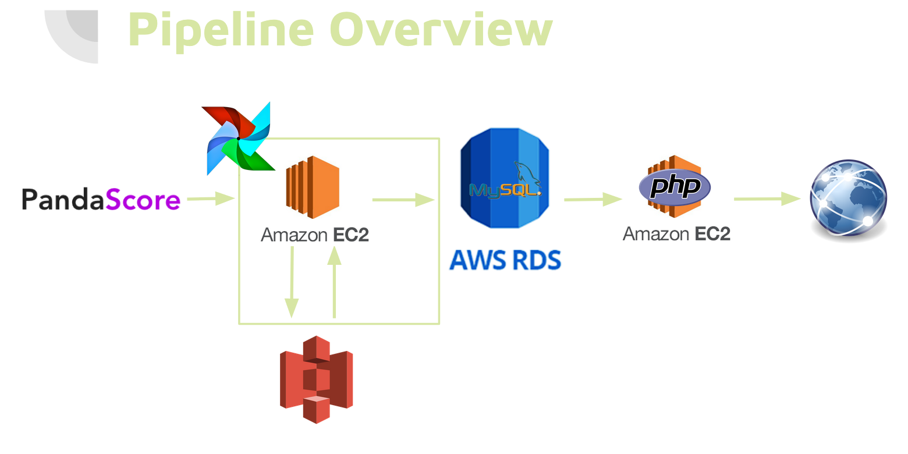
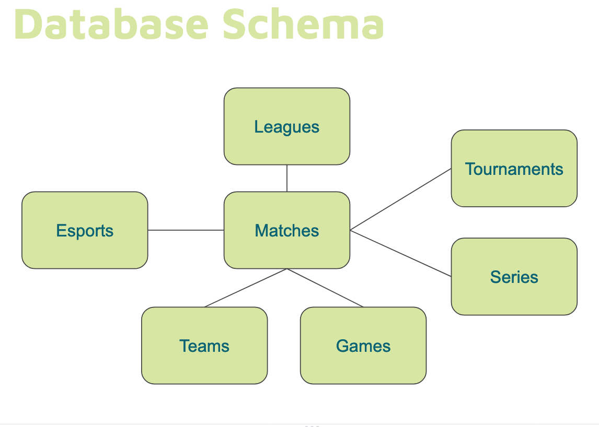

# LevelUpEsports
Hello! Welcome to my Insight Data Engineering project. I created a queryable database from PandaScore's API to support analytics on organizational success in the esports industry.

# Background
Esports is a growing entertainment industry based around competitive video gaming. As with any emerging industry, it can be a challenge to identify, measure, and track success over time. Data in this space can help organizations attract potential sponsors and help potential sponsors identify potential investments.

# Solution 
http://levelupesports.xyz/

# Pipeline Discussion
#### Data Source
I wanted a data source that could support cross-title analyses; PandaScore's API provided data from five different esports titles and structured in a way that facilitated reusing code for both the ingestion and the ETLs. 

One of the limititations of the most basic (free) API was that results were paginated and would only return fifty rows of data per call. However, the API limit was sufficiently large enough that I could query the entire dataset every hour if I needed to. If this was not the case, I would have needed to validate the results of an API call to make sure that no matches went unaccounted for: One of the columns, _match_id_, is unique but not in order. Another, _scheduled_at_ is in order, but not unique. My approach would have looked at all of the matches from the previous API request with the last _scheduled_at_ value and then verified that all of the _match_id_ values from that schedule time were also present in the new API request.

#### Schema

The data I had was primarily focused around matches: who won them specifically, so it made sense to have match facts as the central table in this star-schema with teams and other entities as surrounding dimensionsal tables. Although the business value for the project mostly comes from teams, storing each team with all of their match results in a single table would not be practical for a MySQL solution. A NoSQL schema could provide easier access to tailored reports about any particular team or esports title, but would not support ad-hoc analyses as well, especially as an organization may have several different team names under them or change team names over time.
